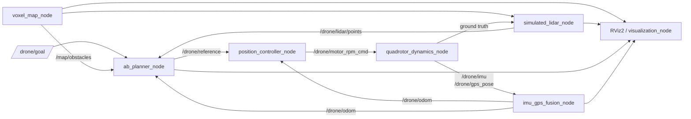

# AKE Drone Sim（ROS2 Humble）

一个面向四旋翼动力学、状态估计、SE(3) 控制与三维静态避障的轻量级 ROS2 仿真工作区。

系统以四个电机转速 RPM 作为动力学输入，模拟四旋翼刚体运动、电机一阶响应、IMU/GPS 观测和 ESKF 状态估计；规划端使用三维 voxel map、26 邻域 Weighted A*、路径简化、三次 B-spline 和 jerk 受限滚动运动学预测生成控制参考，并使用 RViz2 展示地图、点云、规划路径和实际轨迹。

> **能力边界**
>
> - 当前正式验收场景为**已知静态障碍物**。
> - 模拟 LiDAR 用于局部轨迹威胁确认和重规划触发，点云暂未融合进 A* 使用的全局占用地图，因此不宣称实现未知动态障碍物在线绕行。
> - 当前滚动预测模块不构造代价函数，也不在线求解 QP/NLP；其本质是施加速度、加速度和 jerk 限幅的运动学前向预测器，不属于严格意义上的 MPC。
> - 为兼容现有代码和 RViz 配置，部分历史接口仍保留 `mpc` 命名，例如 `/drone/mpc_prediction_path`。

---

## 1. 项目展示

<!--
提交前建议替换为真实链接：
- [PDF 报告](report/AKE_Drone_Sim_Report.pdf)
- [演示视频](https://...)
-->

---

## 2. 功能概览

### 动力学与传感器

- 四旋翼位置、速度、姿态四元数和机体系角速度；
- 四电机实际 RPM 状态；
- 电机一阶响应；
- `F_i = k_F ω_i²` 推力模型；
- X 型四旋翼 roll、pitch、yaw 力矩分配；
- 刚体平动与转动方程；
- 四元数姿态积分与归一化；
- RPM 上下限、异常输入和 NaN/Inf 保护；
- 简化地面接触与起飞边界保护；
- 带固定随机种子的 IMU/GPS 观测仿真。

### 状态估计与控制

- 15 状态误差状态卡尔曼滤波器 ESKF；
- IMU 高频预测，低频位置/简化姿态观测更新；
- 带轨迹速度和加速度前馈的 SE(3) 串级控制；
- SO(3) 姿态误差和角速度误差反馈；
- 总推力、三轴力矩到四电机 RPM 的 X 型 mixer；
- 速度、加速度、倾角、角速度、力矩、推力和 RPM 限幅；
- 里程计失效、参考超时和规划期间的安全悬停保护。

### 地图、规划与可视化

- 固定或随机三维 voxel map；
- 固定随机种子，保证随机场景可复现；
- 前向模拟 3D LiDAR，支持有限视场、量程和第一命中遮挡；
- 26 邻域三维 Weighted A*；
- 障碍物安全膨胀和线段碰撞检查；
- A* 路径可见性简化；
- 三次均匀 B-spline 平滑；
- B-spline 碰撞检测和安全 A* 折线回退；
- jerk 受限滚动运动学预测；
- 异步规划、目标 generation 保护和规划期间悬停；
- RViz2 显示无人机、目标、障碍物、LiDAR 点云、规划路径和实际轨迹；
- 自动实验记录、曲线绘制和验收指标统计。

---

## 3. 与参考项目的关系

本项目参考了以下项目的系统组织和算法思想，但不是对原仓库的 ROS2 封装，也不依赖其运行环境。

| 参考项目 | 参考内容 | 本项目中的处理 |
|---|---|---|
| `pengyu_sim` | 四旋翼仿真系统的动力学、控制和可视化组织方式 | 根据本任务接口重新实现 ROS2 动力学、RPM 输入和状态发布链路 |
| `MARSIM` | 三维点云地图、局部感知和仿真可视化思路 | 实现轻量级 voxel map 与前向射线 LiDAR，不使用其仿真后端 |
| 原 `pwm_se3_controller` | 位置/速度误差、期望合力、几何姿态控制和 mixer 思路 | 重构为 ROS2 SE(3) 控制器，并将输出统一为四电机 RPM |
| 原 `imu_gps_fusion` | IMU 预测和低频观测修正思路 | 重构为 ROS2 15 状态 ESKF，输出闭环使用的 `/drone/odom` |
| 原 `AB_planner` | 路径搜索和局部参考生成思路 | 重构为三维 Weighted A*、B-spline、安全回退和滚动预测 |

本仓库中的 ROS2 节点接口、四电机 RPM 动力学闭环、异步规划保护、实验脚本和验收结果均围绕本任务重新设计和验证。

---

## 4. 系统架构



系统将真值和闭环反馈分离：

- `/drone/ground_truth/odom` 只用于传感器仿真、评测和对比；
- 控制器和规划器只使用 ESKF 输出的 `/drone/odom`；
- 传感器噪声和估计误差会真实进入控制闭环。

---

## 5. 工作区结构

```text
ake_drone_sim/
├── README.md
├── ai_usage.md
├── src/
│   ├── drone_msgs/           # TrajectorySetpoint.msg
│   ├── drone_dynamics/       # 动力学、IMU/GPS、ESKF
│   ├── drone_controller/     # SE(3) 控制器与 RPM mixer
│   ├── drone_map/            # 3D voxel grid 与模拟 LiDAR
│   ├── drone_planner/        # Weighted A*、B-spline、滚动预测
│   └── drone_visualization/  # Marker、RViz 与 bringup 资源
├── launch/                   # sim、open、narrow、random
├── config/                   # 物理、传感器、地图和规划参数
├── rviz/                     # RViz2 配置
├── scripts/                  # 数据记录与绘图
└── report/                   # PDF 报告与实验结果
```

每个 `src` 子目录均为独立 ROS2 package。`drone_map` 导出 voxel 核心库，`drone_planner` 在该地图表示上实现搜索，`drone_msgs` 不依赖具体仿真实现。

---

## 6. 环境与构建

### 6.1 推荐环境

- Ubuntu 22.04
- ROS2 Humble
- C++17
- Python 3
- Eigen3
- RViz2
- Matplotlib

### 6.2 克隆仓库

```bash
cd ~
git clone https://github.com/A-Keeee/drone_sim.git ake_drone_sim
cd ake_drone_sim
```

### 6.3 安装依赖

```bash
sudo apt update
sudo apt install -y \
  ros-humble-desktop \
  ros-humble-pcl-ros \
  libeigen3-dev \
  python3-colcon-common-extensions \
  python3-rosdep \
  python3-matplotlib
```

首次使用 rosdep 时执行：

```bash
sudo rosdep init
rosdep update
```

安装工作区依赖：

```bash
source /opt/ros/humble/setup.bash
rosdep install --from-paths src --ignore-src -r -y
```

### 6.4 编译

```bash
source /opt/ros/humble/setup.bash
colcon build --symlink-install --cmake-args -DCMAKE_BUILD_TYPE=Release
source install/setup.bash
```

### 6.5 测试

```bash
colcon test
colcon test-result --verbose
```

---

## 7. 快速启动

每个新终端均需要：

```bash
cd ~/ake_drone_sim
source /opt/ros/humble/setup.bash
source install/setup.bash
```

### 7.1 五障碍三维避障

```bash
ros2 launch drone_visualization sim.launch.py
```

另开终端发布目标：

```bash
ros2 topic pub --once /drone/goal geometry_msgs/msg/PoseStamped \
  "{header: {frame_id: map}, pose: {position: {x: 8.0, y: 0.0, z: 1.5}, orientation: {w: 1.0}}}"
```

### 7.2 空旷悬停与单目标

```bash
ros2 launch drone_visualization open.launch.py
```

悬停目标：

```bash
ros2 topic pub --once /drone/goal geometry_msgs/msg/PoseStamped \
  "{header: {frame_id: map}, pose: {position: {x: 0.0, y: 0.0, z: 1.5}, orientation: {w: 1.0}}}"
```

单目标：

```bash
ros2 topic pub --once /drone/goal geometry_msgs/msg/PoseStamped \
  "{header: {frame_id: map}, pose: {position: {x: 2.0, y: 1.0, z: 1.5}, orientation: {w: 1.0}}}"
```

### 7.3 强制爬升三维绕行

```bash
ros2 launch drone_visualization narrow.launch.py
```

```bash
ros2 topic pub --once /drone/goal geometry_msgs/msg/PoseStamped \
  "{header: {frame_id: map}, pose: {position: {x: 8.0, y: 0.0, z: 1.5}, orientation: {w: 1.0}}}"
```

### 7.4 固定种子的随机地图

```bash
ros2 launch drone_visualization random.launch.py
```

指定随机种子：

```bash
ros2 launch drone_visualization random.launch.py seed:=42
```

默认配置使用固定随机种子生成可复现的三维盒体障碍物，并将一部分障碍物偏置到起点—终点直线路径附近，以便观察明显绕行。

无界面运行：

```bash
ros2 launch drone_visualization sim.launch.py rviz:=false
```

RViz2 的 Goal 工具已配置到 `/drone/goal`。二维 Goal 通常不包含有效高度，当目标高度低于阈值时，规划器会使用默认巡航高度 `1.5 m`。

---

## 8. 节点与 Topic

| 节点 | 主要订阅 | 主要发布 | 默认频率 |
|---|---|---|---:|
| `quadrotor_dynamics_node` | `/drone/motor_rpm_cmd` | `/drone/ground_truth/odom`、`/drone/imu`、`/drone/gps_pose`、`/drone/motor_rpm`、真值路径 | 200 Hz |
| `imu_gps_fusion_node` | IMU、GPS pose | `/drone/odom`、`/drone/path`、`map -> base_link` | IMU 驱动 |
| `position_controller_node` | `/drone/odom`、`/drone/reference` | `/drone/motor_rpm_cmd` | 100 Hz |
| `voxel_map_node` | YAML 参数 | `/map/obstacles`、`/map/obstacle_markers` | 1 Hz / transient-local |
| `simulated_lidar_node` | voxel map、真值位姿 | `/drone/lidar/points` | 10 Hz |
| `ab_planner_node` | 目标、融合里程计、地图、LiDAR | reference、安全目标、A*/B-spline/预测路径、状态 | 50 Hz |
| `visualization_node` | 里程计、目标、安全目标 | `/drone/markers` | 消息驱动 |

`drone_msgs/msg/TrajectorySetpoint` 包含：

- position；
- velocity；
- acceleration；
- yaw；
- yaw rate。

电机命令 `/drone/motor_rpm_cmd` 使用长度为 4 的 `std_msgs/msg/Float32MultiArray`，电机顺序为：

```text
[前左, 后左, 后右, 前右]
```

---

## 9. 坐标系与动力学模型

- 世界坐标系采用 ENU，`map` 的 z 轴向上；
- 四元数表示机体系到世界系的旋转；
- 推力沿机体 `+z` 轴；
- `map -> base_link` 由 ESKF 节点发布；
- `lidar_link` 安装于机体前方；
- 电机旋向符号按 `+ - + -` 产生偏航反扭矩。

### 9.1 电机一阶响应

```text
rpm_dot = (rpm_cmd - rpm) / tau_m
```

实际实现使用一阶系统的精确离散系数，使电机转速逐渐逼近期望值。

### 9.2 推力与力矩

```text
F_i = k_F * omega_i^2
M_i = k_M * omega_i^2
```

动力学与控制器共享相同的 X 型电机位置、旋向、臂长、质量、惯量、`k_F` 和 `k_M` 定义，避免 mixer 与动力学符号不一致。

### 9.3 刚体方程

平动：

```text
m * p_ddot = R(q) * [0, 0, sum(F_i)] + F_ext - m*g*e3 - drag*v
```

转动：

```text
I * omega_dot = tau - omega × (I*omega)
```

姿态使用机体系角速度构造增量四元数：

```text
delta_q = [cos(|omega|*dt/2), axis(omega)*sin(|omega|*dt/2)]
q_next  = normalize(q * delta_q)
```

模型包含简化地面接触和起飞边界保护，以避免未离地时持续穿透地面。该接触模型只用于起飞和落地边界，不模拟完整碰撞动力学。

---

## 10. ESKF 与 SE(3) 控制

### 10.1 ESKF

ESKF 名义状态为：

```text
x_nominal = [position, velocity, attitude, gyro_bias, accel_bias]
```

误差状态为 15 维。IMU 用于高频预测，低频 `PoseStamped` 用于位置和简化姿态观测更新，协方差采用 Joseph 形式更新。

> `gps_pose` 是为了保持轻量级闭环仿真而设计的简化观测接口，其姿态观测不等同于真实单天线 GPS 的直接输出。

### 10.2 SE(3) 控制器

控制器执行以下步骤：

1. 位置和速度误差生成期望加速度，并叠加轨迹加速度前馈；
2. 根据期望合力和 yaw 构造目标旋转矩阵；
3. 由相邻目标旋转矩阵差分并低通得到期望角速度；
4. 由 SO(3) 姿态误差和角速度误差计算三轴力矩；
5. 使用 X 型分配矩阵将总推力和三轴力矩转换为四电机 `omega²`；
6. 转换为 RPM，并执行限幅。

控制器对以下量实施保护：

- 水平和垂直加速度；
- 最大倾角；
- 期望角速度；
- 三轴力矩；
- 总推力；
- 电机 RPM；
- 里程计和轨迹参考时间戳。

3D 路径搜索和平滑碰撞检查在后台线程运行。规划期间，主定时器持续发布固定悬停参考；若里程计仍正常但 reference 超时，控制器锁定当前位置悬停，而不是在空中直接将四电机 RPM 置零。

---

## 11. 三维地图与模拟 LiDAR

### 11.1 Voxel Map

默认地图范围：

| 参数 | 数值 |
|---|---:|
| x 范围 | `[-2, 10] m` |
| y 范围 | `[-4, 4] m` |
| z 范围 | `[0, 5] m` |
| 分辨率 | `0.2 m` |

`/map/obstacles` 发布所有占用体素中心组成的 `PointCloud2`，`/map/obstacle_markers` 用于显示原始盒体。

默认场景包含 5 个位于起点到 `(8,0,1.5)` 之间的三维静态障碍物，能够迫使无人机改变直线路径。

规划安全参数：

```text
safety_distance = 0.50 m
vehicle_radius  = 0.18 m
inflate_radius  = 0.68 m
```

A* 在膨胀后的中心点占用层上进行搜索，因此机体表面理论安全净空为 `0.50 m`。

### 11.2 模拟 LiDAR

默认配置：

- 水平视场角：`120°`；
- 垂直视场角：`60°`；
- 线束数量：`121 × 31`；
- 更新频率：`10 Hz`；
- 有效量程：`0.2–8.0 m`；
- 距离噪声：`0.01 m`；
- 默认漏检率：`0`。

每条射线在 voxel grid 中步进，只返回第一个命中体素，因此能够表达基础遮挡。

规划器将最近三帧点云转换到 `map` 坐标系，并检查点云是否持续接近当前局部轨迹。连续检测到威胁时触发重规划。

> 当前 LiDAR 点云不直接写入 A* 使用的静态占用地图。因此，如果障碍物只存在于 LiDAR 观测中而不在静态地图内，重新执行 A* 不保证产生新的绕行路径。当前实现应理解为“局部轨迹威胁确认与重规划触发”，而不是完整的未知动态障碍物局部建图与避障。

---

## 12. 规划与安全回退

### 12.1 三维 Weighted A*

规划器在膨胀体素地图上使用 26 邻域搜索：

```text
f(n) = g(n) + w_h * h(n)
w_h  = 1.05
```

其中：

- `g(n)` 为累计欧氏移动代价；
- `h(n)` 为到目标体素的欧氏距离；
- `w_h = 1.05` 用于以轻微次优换取搜索效率。

因此该算法更准确地称为 **Weighted A***，不保证获得严格最短路径。

每条邻接边均进行线段碰撞检查，并设置搜索节点预算。规划在后台线程处理地图、起点和目标快照；新目标到来时通过 generation 编号丢弃旧结果。

### 12.2 路径简化与 B-spline

规划流程：

1. 在膨胀地图上执行 Weighted A*；
2. 对 A* 体素路径进行可见性简化；
3. 构造三次均匀 B-spline；
4. 对平滑轨迹密集采样并执行碰撞检查；
5. 首次平滑不安全时增加控制点密度；
6. 仍不安全时回退至经过碰撞验证的 A* 折线。

平滑失败不会退化为“直接飞向原目标”。

### 12.3 jerk 受限滚动运动学预测

预测器状态为位置、速度和加速度，以 jerk 作为状态变化输入。每一步根据参考位置、速度和加速度计算期望加速度，并执行速度、加速度和 jerk 限幅。

恒 jerk 模型为：

```text
p[k+1] = p[k] + v[k]*dt + 0.5*a[k]*dt^2 + (1/6)*j[k]*dt^3
v[k+1] = v[k] + a[k]*dt + 0.5*j[k]*dt^2
a[k+1] = a[k] + j[k]*dt
```

默认预测时域：

```text
30 × 0.05 s = 1.5 s
```

控制器使用约 `0.20 s` 前视状态。每个预测状态在发布前再次检查膨胀地图，发生碰撞时切换到安全 A* 折线参考。

该模块具备滚动时域预测，但没有：

- 显式决策变量；
- 在线代价函数；
- QP/NLP 求解器；
- 障碍物优化约束。

因此不属于严格意义上的 MPC。

### 12.4 历史接口命名

当前代码中可能仍保留以下名称：

```text
MpcSmoother
/drone/mpc_prediction_path
MPC_COLLISION_ASTAR_FALLBACK
Rolling MPC Prediction
```

这些名称属于历史遗留接口。其实际含义均为 jerk 受限运动学滚动预测，不代表在线模型预测优化。

---

## 13. 规划失败条件

规划状态发布到：

```text
/drone/planner_status
```

主要失败与降级行为：

| 状态或情况 | 行为 |
|---|---|
| 起点或目标越界 | 锁定当前位置悬停 |
| 起点或目标位于膨胀障碍物内 | 锁定当前位置悬停 |
| Weighted A* 无路径或超过预算 | 锁定当前位置悬停 |
| B-spline 碰撞 | 回退到安全 A* 折线 |
| 滚动预测进入膨胀体素 | 回退到安全 A* 折线 |
| LiDAR 持续超时 | 锁定当前位置悬停 |
| 后台正在规划 | 持续发布 `PLANNING_HOLD` 悬停参考 |
| 规划期间收到新目标 | 丢弃旧 generation 并重新规划 |

---

## 14. RViz2 图例

展开 RViz2 左侧 `Planning` 分组：

- 红色细线 `Global A-star Path`：Weighted A* 全局路径，对应 `/drone/planned_path`；
- 青色粗线 `B-spline / Safe A-star Fallback`：碰撞检查通过的 B-spline 或最终安全 A* 折线，对应 `/drone/bspline_path`；
- 橙色粗短线 `Rolling MPC Prediction`：历史名称，实际为约 1.5 s 的 jerk 受限滚动运动学预测，对应 `/drone/mpc_prediction_path`；
- 绿色线 `Fused Flight Path`：ESKF 里程计记录的实际历史轨迹，对应 `/drone/path`；
- 灰色障碍物：`/map/obstacles` 与 `/map/obstacle_markers`；
- 橙色点云：`/drone/lidar/points`；
- 蓝色无人机 Marker、绿色用户目标和黄色安全局部目标：`/drone/markers`。

若没有看到路径：

```bash
ros2 topic echo --once --qos-durability transient_local /drone/planned_path
ros2 topic echo --once --qos-durability transient_local /drone/bspline_path
ros2 topic echo --once --qos-durability transient_local /drone/mpc_prediction_path
```

三条 Path 消息的 `header.frame_id` 均应为 `map`，并且 `poses` 不为空。

---

## 15. 实验与绘图

实验验收指标使用 `/drone/ground_truth/odom` 计算；控制器和规划器仍只使用 ESKF 输出的 `/drone/odom`。

每次实验前重新启动对应 launch，以清空动力学、滤波器、规划器和轨迹历史。

确认脚本安装：

```bash
ros2 pkg executables drone_visualization | \
  grep -E 'run_experiment|plot_results|waypoint_mission'
```

### 15.1 悬停

终端 A：

```bash
ros2 launch drone_visualization open.launch.py
```

终端 B：

```bash
ros2 run drone_visualization run_experiment.py \
  --goal 0 0 1.5 --duration 15 --output /tmp/hover.csv

ros2 run drone_visualization plot_results.py \
  /tmp/hover.csv --prefix /tmp/hover
```

若需要完整记录从地面起飞的过程，可先启动记录器，再启动 launch。

### 15.2 单目标

```bash
ros2 run drone_visualization run_experiment.py \
  --goal 2 1 1.5 --duration 20 --output /tmp/point.csv

ros2 run drone_visualization plot_results.py \
  /tmp/point.csv --prefix /tmp/point --goal 2 1 1.5
```

### 15.3 多目标航点

重新启动 `open.launch.py` 后执行：

```bash
ros2 run drone_visualization waypoint_mission.py \
  --timeout 90 --output /tmp/waypoint.csv

ros2 run drone_visualization plot_results.py \
  /tmp/waypoint.csv --prefix /tmp/waypoint
```

航点顺序：

```text
(0,0,1.5)
-> (2,0,1.5)
-> (2,2,2.0)
-> (0,2,1.5)
-> (0,0,1.5)
```

无人机进入航点 `0.3 m` 范围并持续 `1 s` 后切换到下一目标。

### 15.4 五障碍静态避障

终端 A：

```bash
ros2 launch drone_visualization sim.launch.py
```

终端 B：

```bash
ros2 run drone_visualization run_experiment.py \
  --goal 8 0 1.5 --duration 45 --output /tmp/avoidance.csv

ros2 run drone_visualization plot_results.py \
  /tmp/avoidance.csv --prefix /tmp/avoidance \
  --scenario five --safety-distance 0.5
```

### 15.5 强制爬升三维绕行

终端 A：

```bash
ros2 launch drone_visualization narrow.launch.py
```

终端 B：

```bash
ros2 run drone_visualization run_experiment.py \
  --goal 8 0 1.5 --duration 50 --output /tmp/narrow.csv

ros2 run drone_visualization plot_results.py \
  /tmp/narrow.csv --prefix /tmp/narrow \
  --scenario narrow --safety-distance 0.5
```

绘图器输出：

- `_position.png`；
- `_trajectory.png`；
- `_error.png`；
- `_rpm.png`；
- `_attitude.png`；
- `_clearance.png`；
- `_metrics.txt`。

主要指标包括：

- 最终位置误差；
- 首次进入目标范围时间；
- 稳态误差；
- 最大超调；
- 路径长度；
- 最大 RPM 和饱和样本数；
- 中心轨迹最小障碍距离；
- 扣除机体半径后的机体表面净空。

RPM 饱和统计应使用接近上限的阈值判断，而不是依赖浮点值与最大 RPM 完全相等。

---

## 16. 最新回归结果

| 场景 | 最终误差 | 时间 | 安全与稳定性 |
|---|---:|---:|---|
| 从地面悬停 `(0,0,1.5)` | `0.043 m` | `1.90 s` 首次进入 `0.3 m` | 最后 2 s 平均误差 `0.034 m`，无 RPM 饱和 |
| 单目标 `(2,1,1.5)` | `0.041 m` | `3.36 s` 首次进入 `0.3 m` | 无姿态发散或 RPM 饱和 |
| 多目标正方形 | `0.067 m` | 总用时约 `16.44 s` | 5/5 阶段到达 |
| 五障碍 `(8,0,1.5)` | `0.063 m` | `25.61 s` 首次进入 `0.3 m` | 机体表面净空 `0.563 m > 0.5 m` |
| 强制爬升绕行 | `0.039 m` | `16.57 s` 首次进入 `0.3 m` | 最大高度 `4.121 m`，机体表面净空 `0.758 m > 0.5 m` |

任务最低要求为目标点误差收敛到 `0.3 m` 以内；当前五类回归实验均达到该要求。两项避障实验的机体表面最小净空均大于设定的 `0.5 m` 安全距离。

完整曲线和指标见 [report/results](report/results)。

---

## 17. 已修复的关键失败案例

早期版本在规划器定时器内同步执行耗时 A* 和 B-spline 碰撞检查。规划阻塞超过控制器 reference 超时后，控制器将电机 RPM 置零，导致无人机从悬停高度坠地。

修复内容：

1. A*、路径简化、B-spline 和弧长表构建移入后台线程；
2. 后台线程只处理地图、起点和目标快照；
3. 主定时器在 `PLANNING_HOLD` 状态持续发布悬停参考；
4. 使用 generation 丢弃被新目标取代的旧结果；
5. 区分 odom 超时和 reference 超时；
6. odom 正常但 reference 超时时锁定当前位置，而不是切零 RPM。

该案例说明：对于空中机器人，规划器计算耗时和消息超时策略同样属于闭环安全设计的一部分。

---

## 18. 参数调整

主要参数位于：

```text
config/sim.yaml
config/random.yaml
```

可配置内容包括：

- 质量、惯量、臂长、推力/扭矩系数和电机时间常数；
- IMU/GPS 噪声和固定随机种子；
- voxel 分辨率、地图范围和障碍物数组；
- 随机场景障碍数量、尺寸范围、端点净空和走廊偏置；
- LiDAR FOV、线束数、量程、噪声和漏检率；
- SE(3) 的 `kp/kv/kr/kw`；
- 角速度滤波、力矩、倾角、加速度和 RPM 限幅；
- A* 搜索预算、启发权重、安全距离和参考速度；
- 目标锁定阈值；
- 滚动预测时域、步长、速度、加速度、jerk、反馈增益和前视索引。

当前调优基线：

```text
kp = [2.2, 2.2, 3.5]
kv = [3.0, 3.0, 3.8]
kr = [0.12, 0.12, 0.08]
kw = [0.065, 0.065, 0.065]
reference_speed = 0.8 m/s
```

修改物理参数后，应重新确认：

- 理论悬停 RPM；
- 控制增益；
- 最大 RPM；
- 推力和力矩分配；
- 位置误差和姿态响应。

修改地图范围或分辨率时，应同步确认 map、LiDAR 和 planner 的网格配置。

---

## 19. 当前局限

1. 动力学未建模复杂桨叶气动、地效、电池电压下降和高保真接触；
2. 外力接口尚未完整 ROS 化，没有风场节点和扰动恢复实验；
3. LiDAR 点云未形成带 TTL 的局部占用层；
4. 未估计动态障碍物速度；
5. jerk 受限滚动预测器不是在线优化 MPC；
6. mixer 使用矩阵逆和逐电机截断，未实现带执行器约束的最优控制分配；
7. GPS pose 中的姿态属于简化观测；
8. 仅支持单无人机，Topic 和 frame 尚未全部 namespace 化；
9. 可视化依赖 RViz2，没有独立 Web/Qt 地面站。

---

## 20. 后续工作

优先计划：

1. 增加 `/drone/external_force` 和可配置阵风/持续风场；
2. 增加圆轨迹、八字轨迹发生器和跟踪误差统计；
3. 将 LiDAR 点云融合为带 TTL 的局部占用层；
4. 支持未知障碍物触发真实路径变化；
5. 将 Topic 和 frame 参数化，支持多无人机 namespace；
6. 实现简洁 Web 地面站；
7. 将 jerk 序列作为决策变量，进一步研究带安全走廊约束的真正 MPC。

---

## 21. AI 辅助编程说明

本项目使用 AI 辅助代码审计、问题定位、异步规划修复、测试执行、指标分析和文档整理。

所有核心公式、Topic、坐标系、电机编号、mixer 符号和实验结果均经过人工检查，并通过以下方式验证：

- `colcon build`；
- `colcon test`；
- ROS2 节点日志；
- Topic 和 TF 检查；
- RViz2 可视化；
- CSV 数据；
- 误差、RPM、姿态和最小净空曲线；
- 实际运行二进制和源码时间戳检查。

完整说明、关键 Prompt、AI 产生过的问题和修正过程见 [ai_usage.md](ai_usage.md)。

---
