# AKE Drone Sim：ROS2 四旋翼动力学、<br>控制与三维避障仿真系统


## 摘要

本文设计并实现了一套不依赖 Gazebo、AirSim 的轻量级 ROS2 四旋翼仿真系统。系统以四个电机转速 RPM 为动力学输入，仿真位置、速度、姿态、角速度和电机动态。带前馈的 SE(3) 串级控制器将位置、速度、加速度和偏航参考转换为总推力、三轴力矩及四电机 RPM。

感知与规划部分使用模拟 IMU/GPS 和 15 状态误差状态卡尔曼滤波器（ESKF）产生闭环反馈里程计，并通过三维 voxel grid、前向模拟 LiDAR、26 邻域 3D A*、三次 B-spline 和受速度/加速度/jerk 约束的滚动预测器完成静态避障。RViz2 用于展示无人机、目标、点云地图、感知点云、规划路径和实际轨迹。

系统已完成从地面悬停、单目标、多目标正方形、五障碍避障和强制爬升绕行五类实跑。各目标最终误差均小于 `0.3 m`；五障碍和强制爬升场景扣除机体半径后的最小净空分别为 `0.563 m` 和 `0.758 m`，均大于 `0.5 m` 安全距离。

针对早期同步 A* 阻塞参考发布、导致控制器超时并输出零 RPM 的失败案例，本文将搜索和平滑碰撞检查移入后台线程，并增加控制器当前位置悬停降级策略。修复后，即使五障碍规划耗时仍超过旧参考超时阈值，无人机也能持续悬停，不再坠地。

**关键词：** ROS2；四旋翼动力学；SE(3) 控制；ESKF；3D A*；B-spline；voxel map；避障

---

## 1. 项目目标与实现范围

### 1.1 任务目标

本项目的核心目标是打通以下闭环：

1. 控制器接收目标或轨迹参考，输出四个电机 RPM；
2. 动力学模型根据四个电机 RPM 推进刚体状态；
3. 模拟传感器根据真值状态产生带噪声的 IMU/GPS；
4. ESKF 输出估计里程计，作为控制器和规划器的唯一反馈；
5. 规划器根据地图、目标和局部 LiDAR 生成安全参考；
6. RViz2 和评测脚本展示并量化飞行结果。

地图和避障虽然属于任务选做项，本项目仍实现了完整的三维地图、局部感知和规划链路。

### 1.2 软件包划分

| ROS2 包 | 主要职责 | 主要实现语言 |
|---|---|---|
| `drone_msgs` | 定义包含位置、速度、加速度、yaw、yaw rate 的 `TrajectorySetpoint` | ROS2 msg |
| `drone_dynamics` | 刚体动力学、电机模型、IMU/GPS 仿真、ESKF | C++17 |
| `drone_controller` | SE(3) 位置/姿态控制和 X 型四旋翼 mixer | C++17 |
| `drone_map` | 三维 voxel grid、固定/随机障碍物、模拟 LiDAR | C++17 |
| `drone_planner` | 3D A*、路径简化、B-spline、滚动预测和安全回退 | C++17 |
| `drone_visualization` | RViz Marker、launch、配置和实验脚本安装 | C++17 / Python |

### 1.3 设计取舍

本系统采用“算法可读、依赖较少、可一键启动”的设计。动力学和传感器直接在 ROS2 节点中计算，不引入复杂渲染或物理引擎；地图使用规则体素数组，便于解释膨胀与碰撞检测；规划器使用确定性的 A*，便于复现实验。代价是碰撞、气动和传感器模型的高保真程度不如专业仿真器，当前系统更适合控制/规划算法教学、接口验证和回归测试。

---

## 2. 系统架构

### 2.1 节点、Topic 与数据流

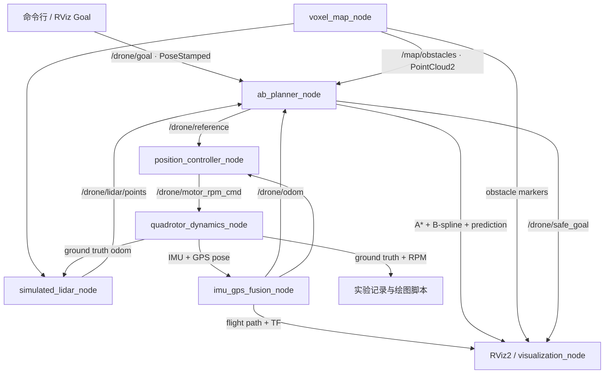
```mermaid
flowchart TB
    U[命令行 / RViz Goal]
    M[voxel_map_node]
    L[simulated_lidar_node]
    P[ab_planner_node]
    C[position_controller_node]
    D[quadrotor_dynamics_node]
    E[imu_gps_fusion_node]
    V[RViz2 / visualization_node]
    R[实验记录与绘图脚本]

    U -->|/drone/goal · PoseStamped| P
    M -->|/map/obstacles · PointCloud2| P
    M --> L
    D -->|ground truth odom| L
    L -->|/drone/lidar/points| P

    D -->|IMU + GPS pose| E
    E -->|/drone/odom| P
    E --> C
    P -->|/drone/reference| C
    C -->|/drone/motor_rpm_cmd| D

    E -->|flight path + TF| V
    P -->|A* + B-spline + prediction| V
    M -->|obstacle markers| V
    P -->|/drone/safe_goal| V
    D -->|ground truth + RPM| R
```

*图 2-1　系统节点、Topic 与闭环数据流。*

系统特意将真值与反馈估计分开：`/drone/ground_truth/odom` 只进入传感器仿真和评测，不直接进入控制器；控制器和规划器只使用 ESKF 输出的 `/drone/odom`。这样能够暴露传感器噪声和估计误差对闭环系统的影响。

### 2.2 主要接口0

| 节点 | 订阅 | 发布 | 典型频率 |
|---|---|---|---:|
| `quadrotor_dynamics_node` | `/drone/motor_rpm_cmd` | 真值 odom、IMU、GPS、实际 RPM、真值路径 | 动力学 200 Hz；GPS 约 10 Hz |
| `imu_gps_fusion_node` | IMU、GPS pose | `/drone/odom`、`/drone/path`、`map -> base_link` | 随 IMU 更新 |
| `position_controller_node` | `/drone/odom`、`/drone/reference` | `/drone/motor_rpm_cmd` | 100 Hz |
| `voxel_map_node` | 参数文件 | 障碍点云、MarkerArray | 1 Hz，Transient Local |
| `simulated_lidar_node` | 地图、真值 odom | `/drone/lidar/points` | 10 Hz |
| `ab_planner_node` | 目标、估计 odom、地图、LiDAR | 参考、安全目标、规划路径、状态 | 主循环 50 Hz |
| `visualization_node` | odom、目标、安全目标 | `/drone/markers` | 随消息更新 |

### 2.3 坐标系与电机编号

- 世界坐标系为 ENU，`map` 的 z 轴向上；
- 四元数表示机体系到世界系的旋转；
- 推力方向为机体 `+z`；
- `map -> base_link` 由融合节点发布；
- `lidar_link` 位于机体前方约 `0.08 m`；
- 电机数组顺序为：前左、后左、后右、前右；
- 电机旋向符号按 `+ - + -` 产生偏航反扭矩。

---

## 3. 四旋翼动力学与传感器模型

### 3.1 状态与输入

动力学状态写为

$$
\mathbf{x}=\left[\mathbf{p}^T,\mathbf{v}^T,\mathbf{q}^T,
\boldsymbol{\omega}^T,n_1,n_2,n_3,n_4\right]^T,
$$

其中 $\mathbf{p}\in\mathbb{R}^3$ 为世界系位置，$\mathbf{v}\in\mathbb{R}^3$ 为世界系速度，$\mathbf{q}$ 为单位四元数，$\boldsymbol{\omega}\in\mathbb{R}^3$ 为机体系角速度，$n_i$ 为第 $i$ 个电机实际 RPM。控制输入是四电机期望转速

$$
\mathbf{u}=[n_{1,c},n_{2,c},n_{3,c},n_{4,c}]^T.
$$

所有输入先检查有限性，再限制在 `[min_rpm,max_rpm]`，当前最大值为 `9000 RPM`。

### 3.2 电机一阶响应

电机不瞬间达到命令转速，而满足

$$
\dot n_i=\frac{n_{i,c}-n_i}{\tau_m}.
$$

代码使用一阶系统的精确离散系数：

$$
n_i^{k+1}=n_i^k+\left(1-e^{-\Delta t/\tau_m}\right)
\left(n_{i,c}^k-n_i^k\right),
$$

其中电机时间常数 $\tau_m=0.035 s$。RPM 转角速度为

$$
\Omega_i=n_i\frac{2\pi}{60}.
$$

### 3.3 推力与力矩

单电机推力和反扭矩模型为

$$
F_i=k_F\Omega_i^2,\qquad M_i=k_M\Omega_i^2.
$$

当前 $k_F=8.54858\times10^{-6}$，$k_M=1.6\times10^{-7}$。对臂长为 $l$ 的 X 型布局，定义 $a=l/\sqrt{2}$，总推力与三轴力矩满足

$$
\begin{aligned}
\begin{bmatrix}
T\\ \tau_x\\ \tau_y\\ \tau_z
\end{bmatrix}
&=
\begin{bmatrix}
1&1&1&1\\
a&a&-a&-a\\
-a&a&a&-a\\
c&-c&c&-c
\end{bmatrix}
\begin{bmatrix}F_1\\F_2\\F_3\\F_4\end{bmatrix},
\\[2mm]
c&=\frac{k_M}{k_F}.
\end{aligned}
$$

动力学与控制器共用同一矩阵约定，避免电机编号或正负号不一致造成 roll/pitch/yaw 方向错误。

### 3.4 平动方程

机体总推力为 $\mathbf{f}_b=[0,0,T]^T$。设 $R(\mathbf{q})$ 为机体系到世界系旋转矩阵，平动方程为

$$
m\dot{\mathbf{v}}=R\mathbf{f}_b+\mathbf{F}_{ext}
-mg\mathbf{e}_3-k_d\mathbf{v},
$$

$$
\dot{\mathbf{p}}=\mathbf{v}.
$$

其中 $m=1.0 kg$，$g=9.80665 m/s^2$，$k_d$ 为线性阻力系数。模型内部保留了 `external_force` 接口，可以继续扩展风扰或外力 topic；目前正式场景没有启用风模型。

### 3.5 转动方程与姿态积分

刚体转动方程为

$$
I\dot{\boldsymbol{\omega}}=\boldsymbol{\tau}
-\boldsymbol{\omega}\times(I\boldsymbol{\omega}),
$$

其中

$$
I=\operatorname{diag}(0.008,0.008,0.014)\;kg\cdot m^2.
$$

角速度采用显式积分。四元数使用由 $\boldsymbol{\omega}\Delta t$ 构造的增量旋转进行右乘：

$$
\mathbf{q}_{k+1}=\operatorname{normalize}
\left(\mathbf{q}_k\otimes
\operatorname{Exp}_q(\boldsymbol{\omega}_{k+1}\Delta t)\right).
$$

每步归一化用于抑制数值漂移。动力学节点周期为 `5 ms`，单步积分 $\Delta t$ 被限制在不超过 `0.01 s`；模型还拒绝异常大步长，并在状态出现 NaN/Inf 时复位。

### 3.6 地面接触简化

最低机体高度设置为 `0.05 m`。当无人机接触地面且推力不足以起飞时：

- 负的垂直速度被清零；
- 水平速度被清零；
- 角速度增加阻尼；
- roll/pitch 逐渐回正，同时保留 yaw。

该模型不是完整的刚体碰撞求解，但能避免未起飞时穿地或因微小数值误差侧翻。

### 3.7 IMU、GPS 与 ESKF

模拟 IMU 输出姿态、机体系角速度和比力：

$$
\mathbf{f}_{imu}=R^T(\mathbf{a}_w+g\mathbf{e}_3)+\mathbf{n}_a,
\qquad
\boldsymbol{\omega}_{imu}=\boldsymbol{\omega}+\mathbf{n}_g.
$$

当前加速度噪声标准差为 `0.025`，陀螺仪噪声标准差为 `0.002`。GPS 位置加入标准差 `0.04 m` 的高斯噪声，随机种子固定，因此实验可以复现。

ESKF 名义状态为

$$
\mathbf{x}_{nom}=[\mathbf{p},\mathbf{v},\mathbf{q},
\mathbf{b}_g,\mathbf{b}_a],
$$

误差状态为 15 维。IMU 用于预测，GPS pose 用于位置和姿态更新，协方差更新采用 Joseph 形式：

$$
P^+=(I-KH)P^-(I-KH)^T+KRK^T.
$$

相较直接反馈真值，这条链路更接近真实飞控的数据流，同时仍保持实现规模可控。

---

## 4. 控制器设计

### 4.1 控制参考

规划器向控制器发布

$$
\mathbf{r}=\{\mathbf{p}_d,\mathbf{v}_d,\mathbf{a}_d,
\psi_d,\dot\psi_d\}.
$$

控制器输出四电机 RPM。控制结构为外环位置/速度控制与内环 SO(3) 姿态/角速度控制。

### 4.2 位置与速度环

期望平动加速度为

$$
\mathbf{a}_c=K_p(\mathbf{p}_d-\mathbf{p})
+K_v(\mathbf{v}_d-\mathbf{v})+\mathbf{a}_d.
$$

当前增益为

$$
K_p=\operatorname{diag}(2.2,2.2,3.5),\qquad
K_v=\operatorname{diag}(3.0,3.0,3.8).
$$

为防止远目标产生过大指令，水平加速度限制为 `2.0 m/s²`，垂直加速度限制为 `±2.5 m/s²`。期望合力为

$$
\mathbf{F}_d=m(\mathbf{a}_c+g\mathbf{e}_3).
$$

### 4.3 期望姿态构造

期望机体 z 轴与合力方向一致：

$$
\mathbf{b}_{3d}=\frac{\mathbf{F}_d}{\|\mathbf{F}_d\|}.
$$

由期望 yaw 构造水平航向向量

$$
\mathbf{b}_{1c}=[\cos\psi_d,\sin\psi_d,0]^T.
$$

进一步得到

$$
\mathbf{b}_{2d}=\frac{\mathbf{b}_{3d}\times\mathbf{b}_{1c}}
{\|\mathbf{b}_{3d}\times\mathbf{b}_{1c}\|},\qquad
\mathbf{b}_{1d}=\mathbf{b}_{2d}\times\mathbf{b}_{3d},
$$

$$
R_d=[\mathbf{b}_{1d},\mathbf{b}_{2d},\mathbf{b}_{3d}].
$$

期望倾角限制为 `0.40 rad`。相邻 $R_d$ 的差分用于估计完整期望角速度，并经过 `0.10 s` 时间常数的一阶低通，以降低参考加速度噪声对姿态环的激励。

### 4.4 SO(3) 姿态与角速度环

姿态误差定义为

$$
\mathbf{e}_R=\frac{1}{2}
\left(R_d^TR-R^TR_d\right)^\vee,
$$

角速度误差为

$$
\mathbf{e}_\omega=\boldsymbol{\omega}
-R^TR_d\boldsymbol{\omega}_d.
$$

控制力矩为

$$
\boldsymbol{\tau}=-K_R\mathbf{e}_R-K_\omega\mathbf{e}_\omega
+\boldsymbol{\omega}\times(I\boldsymbol{\omega}),
$$

其中

$$
K_R=\operatorname{diag}(0.12,0.12,0.08),\qquad
K_\omega=\operatorname{diag}(0.065,0.065,0.065).
$$

总推力取期望合力在当前机体 z 轴上的投影：

$$
T=\operatorname{sat}_{[0,T_{max}]}
\left(\mathbf{F}_d^TR\mathbf{e}_3\right),
$$

其中 $T_{max}=1.8mg$。

### 4.5 Mixer 与 RPM 限幅

控制器将 $[T,\tau_x,\tau_y,\tau_z]^T$ 左乘分配矩阵的逆得到四个单电机推力。若某个理论推力为负，则截断为零：

$$
\Omega_i^2=\max\left(0,\frac{F_i}{k_F}\right),
\qquad
n_i=\operatorname{sat}_{[0,9000]}
\left(\frac{60}{2\pi}\sqrt{\Omega_i^2}\right).
$$

系统还分别限制三轴力矩、期望角速度、总推力和 RPM，避免位置误差突然增大时出现不受约束的控制量。

### 4.6 防炸与超时策略

控制器对里程计和规划参考分别检查新鲜度：

- `/drone/odom` 超过 `0.20 s` 未更新：由于姿态和位置反馈不可信，输出零 RPM；
- 里程计正常、但参考超过 `2.50 s` 未更新：锁定触发时刻的当前位置，速度/加速度参考置零，继续悬停；
- 新参考恢复：退出失联悬停，重新跟踪正常参考。

规划器的 A* 和 B-spline 碰撞检查使用后台线程。主循环在 `PLANNING_HOLD` 状态下以 50 Hz 持续发布固定悬停参考，从源头上避免耗时搜索造成参考断流；控制器的失联悬停则构成第二道保护。

---

## 5. 地图、感知与避障设计

### 5.1 三维 Voxel Map

默认地图范围和分辨率如下：

| 参数 | 数值 |
|---|---:|
| 原点 | `(-2,-4,0) m` |
| 尺寸 | `(12,8,5) m` |
| x 范围 | `[-2,10] m` |
| y 范围 | `[-4,4] m` |
| z 范围 | `[0,5] m` |
| 分辨率 | `0.2 m` |

世界坐标到体素索引的映射为

$$
\mathbf{i}=\left\lfloor
\frac{\mathbf{p}-\mathbf{o}}{r}\right\rfloor.
$$

体素使用连续一维数组保存，占用点作为 `sensor_msgs/msg/PointCloud2` 发布，同时使用 `MarkerArray` 发布原始盒体，便于 RViz 显示。

默认五障碍场景如下，每行是中心位置和三轴尺寸：

| 编号 | 中心 `(x,y,z)` / m | 尺寸 `(sx,sy,sz)` / m | 作用 |
|---:|---|---|---|
| 1 | `(1.5,0.0,1.2)` | `(0.6,2.0,2.4)` | 阻挡起点附近直线 |
| 2 | `(3.0,-1.2,2.0)` | `(0.8,1.6,4.0)` | 左侧高柱 |
| 3 | `(4.0,1.2,2.0)` | `(0.8,1.6,4.0)` | 右侧高柱 |
| 4 | `(5.4,0.0,3.7)` | `(0.8,3.5,1.0)` | 上方横向障碍 |
| 5 | `(6.8,0.0,1.3)` | `(0.8,4.5,2.6)` | 终点前宽障碍 |

随机场景可指定障碍数量和随机种子，并对一部分障碍施加起点—终点走廊偏置。固定种子保证每次地图一致。

### 5.2 安全膨胀与碰撞检测

配置的障碍安全距离为

$$
d_{safe}=0.5m,
$$

无人机近似半径为

$$
r_{uav}=0.18m.
$$

因此 A* 搜索使用的中心点占用层膨胀距离为

$$
d_{inflate}=d_{safe}+r_{uav}=0.68m.
$$

体素膨胀半径换算为体素数量后，在三维球形邻域内扩张占用。路径线段碰撞检查以约 `0.45 × resolution` 的间隔采样。需要注意，实验中的“轨迹最小距离”定义为无人机中心轨迹点到原始 AABB 表面的距离；若评价机体表面净空，应再减去无人机半径，报告必须明确两种口径。

### 5.3 前向模拟 LiDAR

模拟 LiDAR 参数如下：

| 参数 | 数值 |
|---|---:|
| 水平 FOV | `120°` |
| 垂直 FOV | `60°` |
| 水平线束 | `121` |
| 垂直线束 | `31` |
| 频率 | `10 Hz` |
| 有效距离 | `0.2–8.0 m` |
| 距离噪声 | `0.01 m` |
| 默认漏检率 | `0` |

每条射线沿地图步进，遇到第一个占用体素即停止，因此能够表达遮挡。输出点在 `lidar_link` 下，规划器根据估计位姿转换至 `map`。局部点云保留最近三帧，用于确认当前轨迹附近的持续威胁。

### 5.4 3D A* 全局规划

A* 在膨胀体素地图上采用 26 邻域，允许轴向、面对角线和体对角线移动。代价函数为

$$
f(\mathbf{i})=g(\mathbf{i})+w_h h(\mathbf{i}),
$$

其中 $g$ 为累计欧氏移动代价，$h$ 为到目标体素的欧氏距离，启发权重 $w_h=1.05$。每条邻接边都进行线段碰撞检查。搜索节点上限为 `250000`，超限时返回 `search_budget_exhausted`。

A* 在后台线程使用地图、起点、目标的快照运行。每个目标带有 generation 编号；若搜索过程中收到新目标，旧搜索结果标记为 `PLAN_SUPERSEDED` 并被丢弃，从而避免旧路径覆盖新任务。

### 5.5 路径简化与 B-spline

A* 原始体素路径首先执行可见性简化：从当前点尽量连接最远的无碰撞路径点，减少折点数量。随后构造三次均匀 B-spline。平滑轨迹以密集参数采样进行碰撞检查：

1. 首先使用较稀控制点生成平滑曲线；
2. 若碰撞，则用更密控制点重新生成；
3. 若仍碰撞，放弃平滑曲线并执行经过膨胀地图验证的 A* 折线。

因此平滑失败不会退化为“直接飞目标”，而是退化为更保守的安全折线。

### 5.6 弧长采样与滚动预测

B-spline 建立参数 $u$ 与累计弧长 $s$ 的查找表，按

$$
s_{k+1}=s_k+v_{ref}\Delta t
$$

采样参考，避免仅按曲线参数均匀采样导致空间速度不均匀。滚动预测器不是求解在线 QP 的完整 MPC，而是一个有限时域、带约束的运动学前向预测器。对每一步：

$$
\mathbf{a}_{des}=k_p(\mathbf{p}_r-\mathbf{p})
+k_v(\mathbf{v}_r-\mathbf{v})+\mathbf{a}_r,
$$

$$
\mathbf{j}=\operatorname{sat}_{j_{max}}
\left(\frac{\mathbf{a}_{des}-\mathbf{a}}{\Delta t}\right).
$$

再用恒 jerk 模型推进位置、速度和加速度，并限制最大速度、加速度和 jerk。默认预测时域为 `30 × 0.05 = 1.5 s`，控制器采用约 `0.20 s` 前视状态。预测中的每个状态再次检查膨胀地图；发现碰撞时回退到 A* 折线。

### 5.7 规划失败条件与行为

| 失败条件 | 状态 | 安全行为 |
|---|---|---|
| 起点/目标越界或被占用 | `PLAN_FAILED` | 锁定当前位置悬停 |
| 搜索无路径或超预算 | `PLAN_FAILED` | 锁定当前位置悬停 |
| B-spline 碰撞 | A* fallback | 使用安全折线 |
| 滚动预测进入障碍 | `MPC_COLLISION_ASTAR_FALLBACK` | 切换 A* 折线 |
| LiDAR 超时 | `LIDAR_TIMEOUT_HOLD` | 锁定当前位置悬停 |
| 正在耗时规划 | `PLANNING_HOLD` | 持续发布固定悬停参考 |
| 规划期间目标改变 | `PLAN_SUPERSEDED` | 丢弃旧结果并规划新目标 |

---

## 6. 可视化方案

系统采用 RViz2，可视化配置位于 `rviz/sim.rviz`。主要显示项如下：

| 颜色/显示 | Topic | 含义 |
|---|---|---|
| 灰色体素/盒体 | `/map/obstacles`、`/map/obstacle_markers` | 静态障碍地图 |
| 橙色点云 | `/drone/lidar/points` | 前向 LiDAR 当前返回 |
| 红色路径 | `/drone/planned_path` | 3D A* 全局路径 |
| 青色路径 | `/drone/bspline_path` | B-spline 或最终安全折线 |
| 橙色短路径 | `/drone/mpc_prediction_path` | 约 1.5 s 滚动预测 |
| 绿色路径 | `/drone/path` | ESKF 实际历史轨迹 |
| 蓝色方块 | `/drone/markers` | 无人机机体 |
| 绿色球体 | `/drone/markers` | 用户目标 |
| 黄色球体 | `/drone/markers` | 当前安全局部目标 |

RViz 的 Goal 工具发布到 `/drone/goal`。由于 RViz 的 2D Goal 通常产生零高度，规划器会将低于 `0.2 m` 的目标高度替换为默认巡航高度 `1.5 m`。

---

## 7. 实验设计与结果

### 7.1 实验方法与指标

实验脚本订阅真值里程计和实际电机 RPM，以 CSV 保存

$$
[t,x,y,z,x_g,y_g,z_g,\phi,\theta,\psi,n_1,n_2,n_3,n_4].
$$

主要指标定义为：

- 最终位置误差：$e_f=\|\mathbf{p}(t_f)-\mathbf{p}_{goal}\|$；
- 到达时间：首次进入目标点 `0.3 m` 球的时间；多目标脚本额外要求持续 `1 s` 才切换航点；
- 稳态误差：最后一段稳定窗口的位置误差统计；
- 路径长度：$L=\sum_k\|\mathbf{p}_{k+1}-\mathbf{p}_k\|$；
- 最小障碍距离：轨迹点到所有原始障碍 AABB 表面的最小欧氏距离；
- RPM 饱和率：任一电机达到最大 RPM 的采样比例。

每个实验前重新启动 launch，以清空动力学、滤波器、规划器和轨迹历史。

### 7.2 主要参数表

| 分类 | 参数 | 数值 |
|---|---|---:|
| 动力学 | 质量 | `1.0 kg` |
| 动力学 | 惯量 | `[0.008,0.008,0.014] kg·m²` |
| 动力学 | 臂长 | `0.17 m` |
| 电机 | $k_F$ | `8.54858e-6` |
| 电机 | $k_M$ | `1.6e-7` |
| 电机 | 时间常数 | `0.035 s` |
| 电机 | 最大转速 | `9000 RPM` |
| 控制 | $K_p$ | `[2.2,2.2,3.5]` |
| 控制 | $K_v$ | `[3.0,3.0,3.8]` |
| 控制 | $K_R$ | `[0.12,0.12,0.08]` |
| 控制 | $K_\omega$ | `[0.065,0.065,0.065]` |
| 规划 | 参考速度 | `0.8 m/s` |
| 规划 | 安全距离 | `0.5 m` |
| 规划 | 无人机半径 | `0.18 m` |
| 规划 | 地图分辨率 | `0.2 m` |
| 预测 | 时域/步长 | `30 / 0.05 s` |
| 预测 | 速度/加速度/jerk 上限 | `1.2 / 2.0 / 3.0` |

### 7.3 最低验收结果总览

| 验收场景 | 最终误差 | 时间 | 安全与稳定性 | 结论 |
|---|---:|---:|---|:---:|
| 从地面悬停 `(0,0,1.5)` | `0.043 m` | `1.90 s` | RPM 饱和 `0` | 通过 |
| 单目标 `(2,1,1.5)` | `0.041 m` | `3.36 s` | RPM 饱和 `0` | 通过 |
| 多目标正方形 | `0.067 m` | `16.44 s` 总时长 | 5/5 阶段到达 | 通过 |
| 五障碍 `(8,0,1.5)` | `0.063 m` | `25.61 s` | 机体净空 `0.563 m` | 通过 |
| 强制爬升 `(8,0,1.5)` | `0.039 m` | `16.57 s` | 机体净空 `0.758 m` | 通过 |

表中“最小机体净空”由中心轨迹到障碍 AABB 的距离减去 `0.18 m` 机体半径得到。两项避障实验均满足 `0.5 m` 安全距离要求。

### 7.4 悬停实验 `(0,0,1.5)`

记录器在 launch 前启动，首个真值样本高度为 `0.05 m`，因此曲线包含从地面起飞的过程。结果为：

- 约 `1.90 s` 首次进入目标点 `0.3 m` 范围；
- 最终真值位置约 `(0.006,-0.032,1.471) m`；
- 最终误差约 `0.043 m`，最后 2 秒平均误差约 `0.034 m`；
- 最大 roll/pitch 绝对值约 `2.60°`；
- 最大电机转速约 `5777 RPM`，9000 RPM 饱和样本为 `0`；
- 目标锁定后位置、速度、加速度参考保持不变。

| 悬停响应 | 悬停稳定性 |
|:---:|:---:|
| 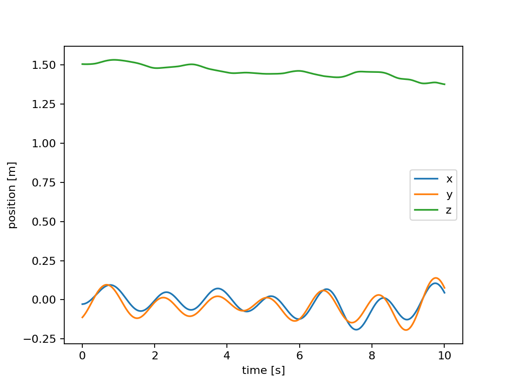<br>**图 7-1　悬停位置曲线** | 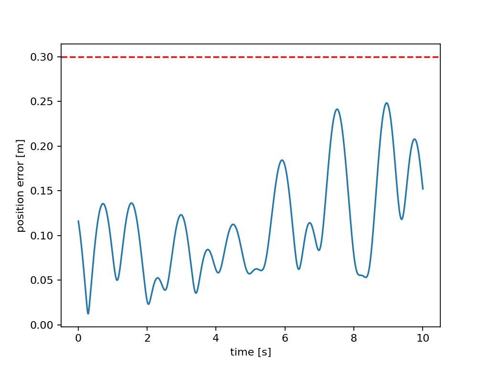<br>**图 7-2　悬停误差曲线** |
| 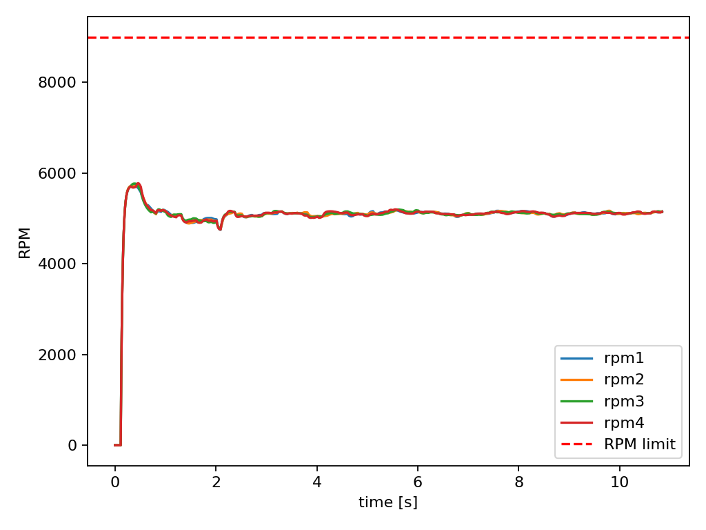<br>**图 7-3　悬停 RPM 曲线** | 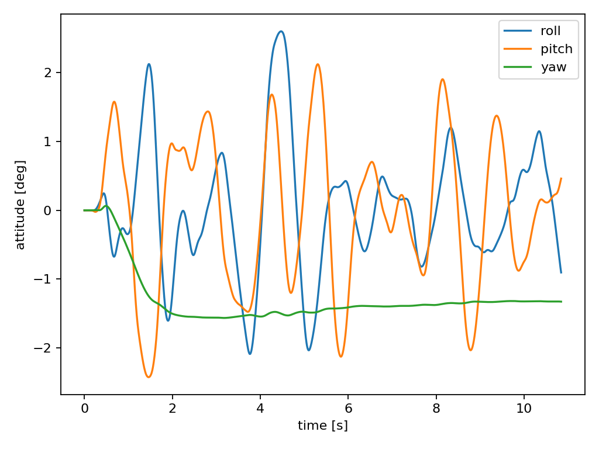<br>**图 7-4　悬停姿态曲线** |

该结果满足任务提出的悬停误差收敛到 `0.3 m` 以内的要求。

### 7.5 单目标实验 `(2,1,1.5)`

空旷地图实跑结果：

- 最终真值位置约 `(2.034,0.978,1.506) m`；
- 最终位置误差约 `0.041 m`，最后 2 秒平均误差约 `0.037 m`；
- 约 `3.36 s` 首次进入 `0.3 m`；
- 沿起终点方向最大超调约 `0.167 m`，采样轨迹长度约 `2.97 m`；
- 最大 roll/pitch 绝对值约 `7.74°`，最大电机转速约 `5215 RPM`；
- 无姿态发散或 RPM 饱和。

| 单目标轨迹与误差 | 单目标稳定性 |
|:---:|:---:|
| 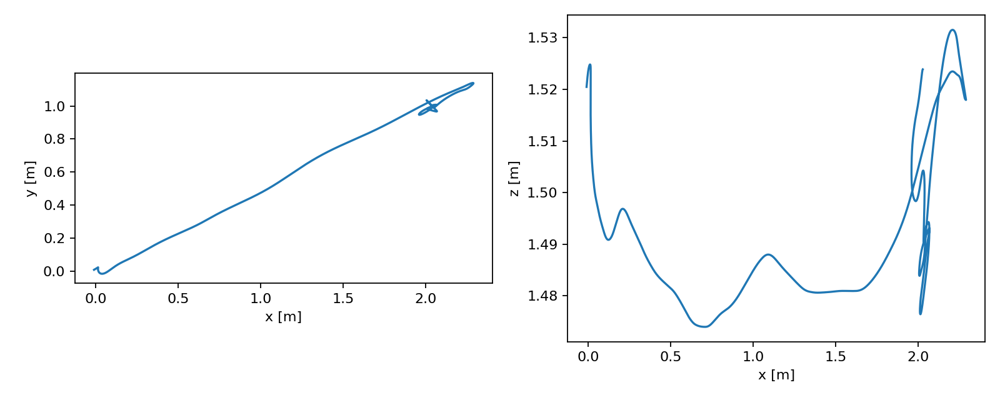<br>**图 7-5　单目标轨迹** | 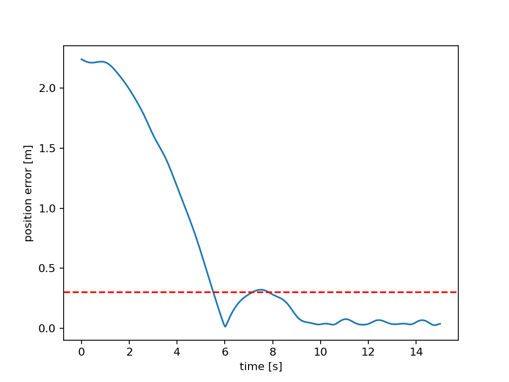<br>**图 7-6　单目标误差** |
| 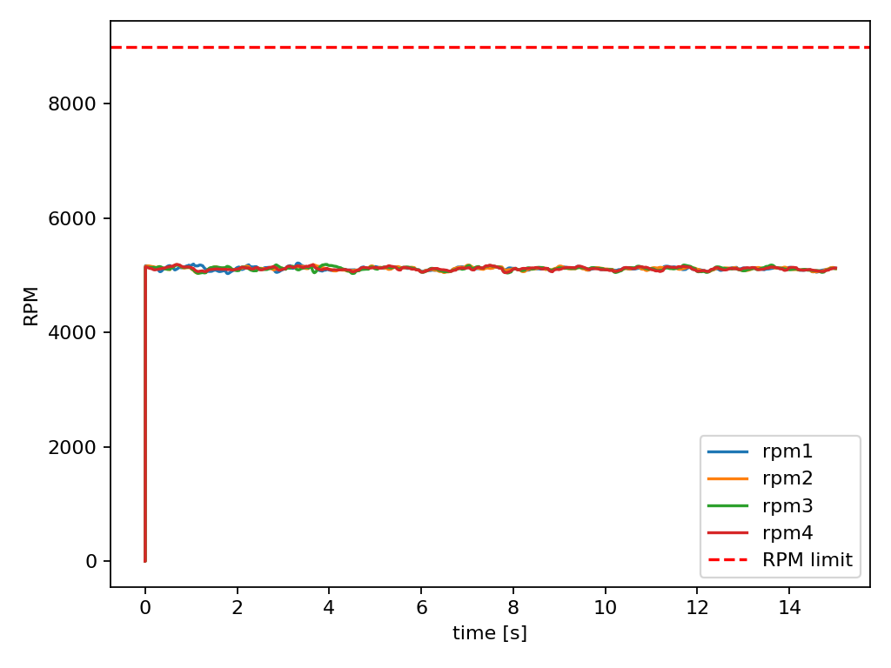<br>**图 7-7　单目标 RPM** | 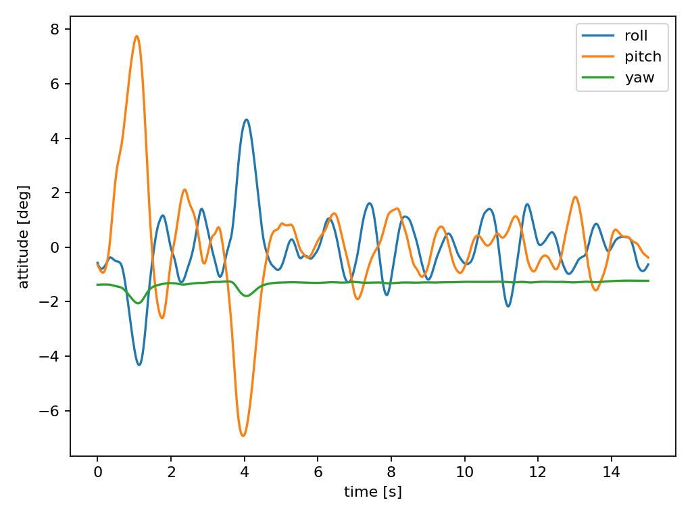<br>**图 7-8　单目标姿态** |

### 7.6 多目标点任务

`waypoint_mission.py` 提供如下顺序航点：

```text
(0,0,1.5) -> (2,0,1.5) -> (2,2,2.0)
-> (0,2,1.5) -> (0,0,1.5)
```

无人机进入航点 `0.3 m` 范围并持续 `1 s` 后切换下一目标。重新启动 `open.launch.py` 后的实跑结果为：

- 起飞点与四个正方形航点全部到达，即 `5/5` 阶段成功；
- 从脚本收到第一帧真值到任务完成约 `16.44 s`；
- 最终位置误差约 `0.067 m`；
- 五段记录到的最小目标误差分别约为 `0.040/0.037/0.070/0.056/0.033 m`；
- 实际采样轨迹累计长度约 `8.95 m`；
- 最大电机转速约 `5358 RPM`，无 RPM 饱和。

| 多目标轨迹 | 多目标误差与 RPM |
|:---:|:---:|
| 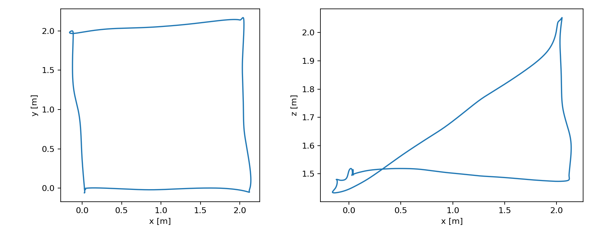<br>**图 7-9　多目标实际轨迹** | 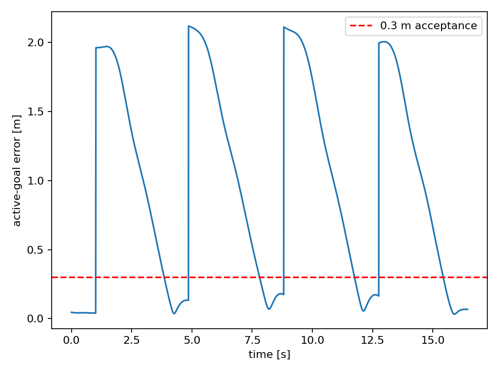<br>**图 7-10　活动目标误差** |
| 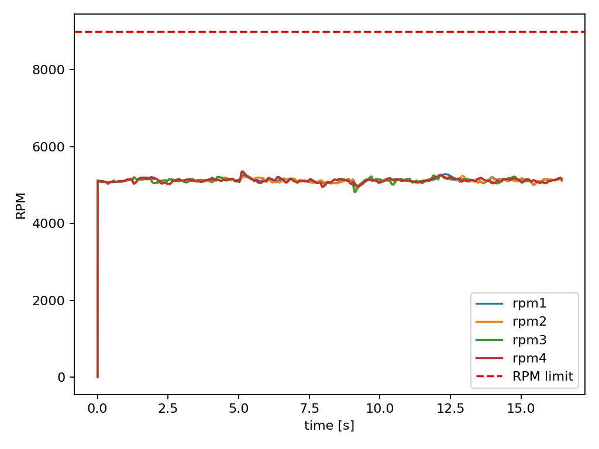<br>**图 7-11　多目标 RPM** |  |

### 7.7 五障碍三维避障 `(8,0,1.5)`

修复异步规划后，使用 `sim.launch.py` 完成 45 秒回归：

- A* 与平滑碰撞检查耗时约 `5.12 s`，期间规划器持续处于 `PLANNING_HOLD`；
- 最终真值位置约 `(8.044,0.037,1.526) m`；
- 最终位置误差约 `0.063 m`，最后 2 秒平均误差约 `0.032 m`；
- 首次进入 `0.3 m` 约为 `25.61 s`；
- 最小中心轨迹—原始 AABB 距离约 `0.743 m`，大于 `0.68 m` 总膨胀半径；再扣除 `0.18 m` 机体半径，机体表面净空仍约为 `0.563 m > 0.5 m`；
- 轨迹采样累计长度约 `15.48 m`；
- 9002 个采样中 RPM 饱和样本为 `0`，最大 roll/pitch 绝对值约 `6.44°`；
- 无穿障、NaN、姿态发散或零 RPM 坠地。

| 五障碍轨迹 | 五障碍安全性与稳定性 |
|:---:|:---:|
| 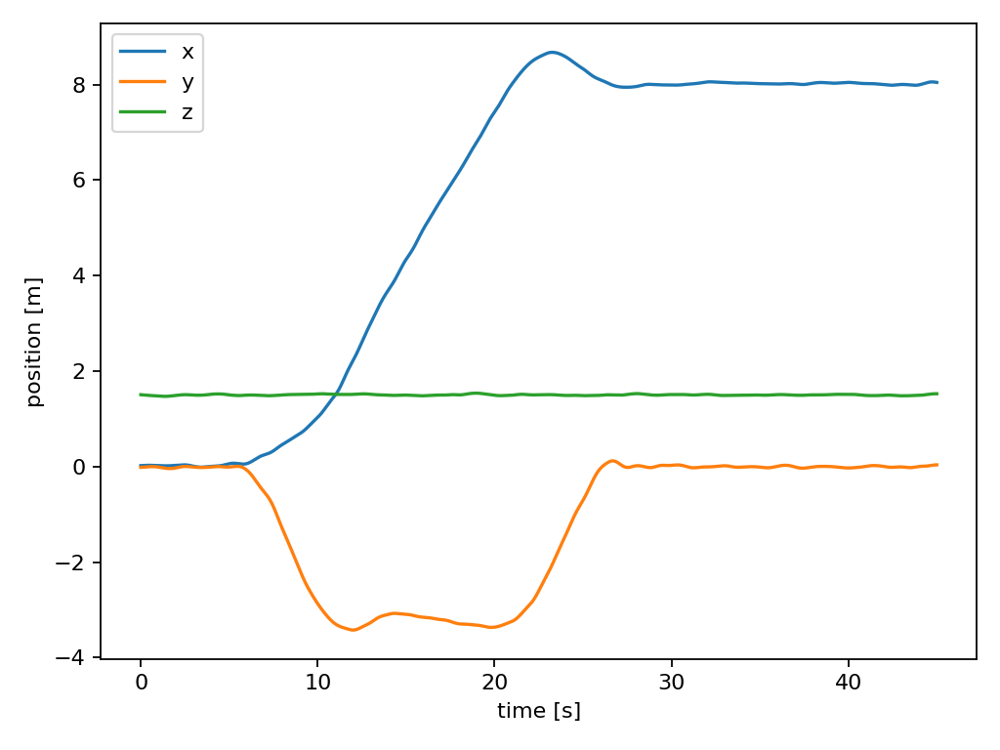<br>**图 7-12　五障碍位置曲线** | <br>**图 7-13　五障碍实际轨迹** |
| <br>**图 7-14　五障碍最小距离** | <br>**图 7-15　五障碍目标误差** |
| <br>**图 7-16　五障碍 RPM** | 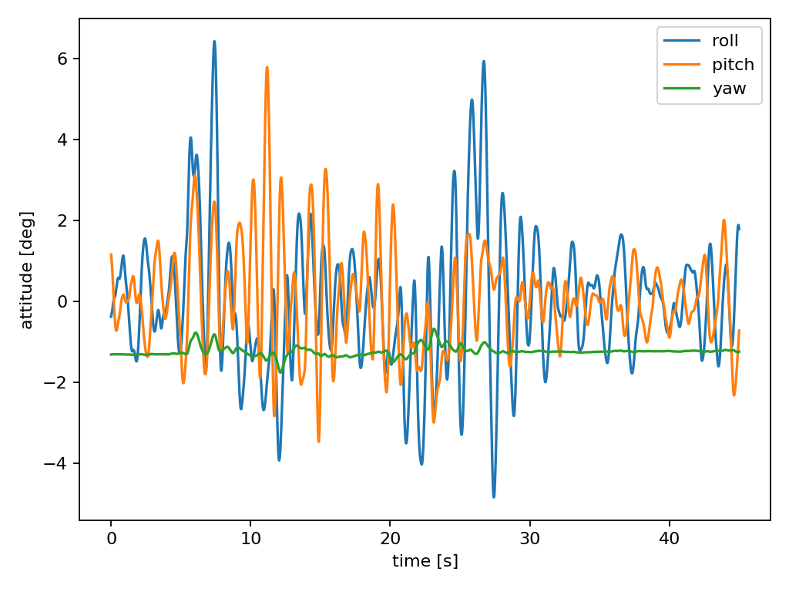<br>**图 7-17　五障碍姿态** |

### 7.8 固定种子随机三维场景

`random.launch.py seed:=20260715` 生成 14 个随机盒体和约 3204 个占用体素。已有实跑记录为：

- A* 展开 7176 个节点，并安全回退为 A* 折线；
- 飞行高度范围约 `1.457–4.099 m`，产生明显三维爬升绕行；
- 最终 6 秒真值均值约 `(8.018,0.005,1.504) m`；
- 最终悬停 x/y/z 峰峰值约 `0.063/0.048/0.039 m`；
- 实际轨迹到规划折线平均/95%/最大距离约 `0.032/0.060/0.122 m`；
- 扣除体素半对角线后的保守中心净空约 `0.630 m`；
- 无穿障、NaN、姿态发散或持续 RPM 饱和。

### 7.9 狭窄/明显绕行场景

`narrow.launch.py` 使用贯穿 y 方向、顶部高度为 `3.0 m` 的墙体，并用四个边界柱限制侧向绕行。目标仍为 `(8,0,1.5) m`。50 秒实跑结果为：

- A* 展开 `4144` 个节点并生成越过墙顶的路径；
- 最大高度约 `4.121 m`；在 `x=3.5–4.5 m` 的墙体穿越区域，高度约为 `4.002–4.121 m`，证明不是从墙中穿过；
- 约 `16.57 s` 首次进入目标点 `0.3 m` 范围；
- 最终真值位置约 `(8.035,0.014,1.511) m`，最终误差约 `0.039 m`；
- 轨迹长度约 `11.65 m`；
- 最小中心轨迹—AABB 距离约 `0.938 m`；扣除机体半径后的表面净空约 `0.758 m > 0.5 m`；
- 最大 roll/pitch 绝对值约 `8.32°`，无 RPM 饱和。

| 狭窄场景轨迹 | 狭窄场景安全性与稳定性 |
|:---:|:---:|
| 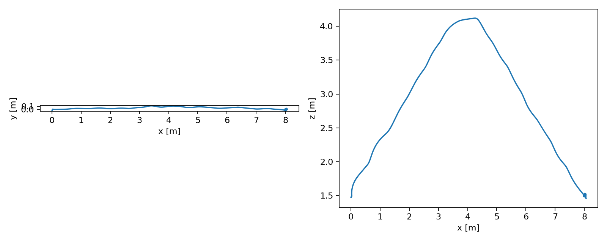<br>**图 7-18　狭窄场景实际轨迹** | 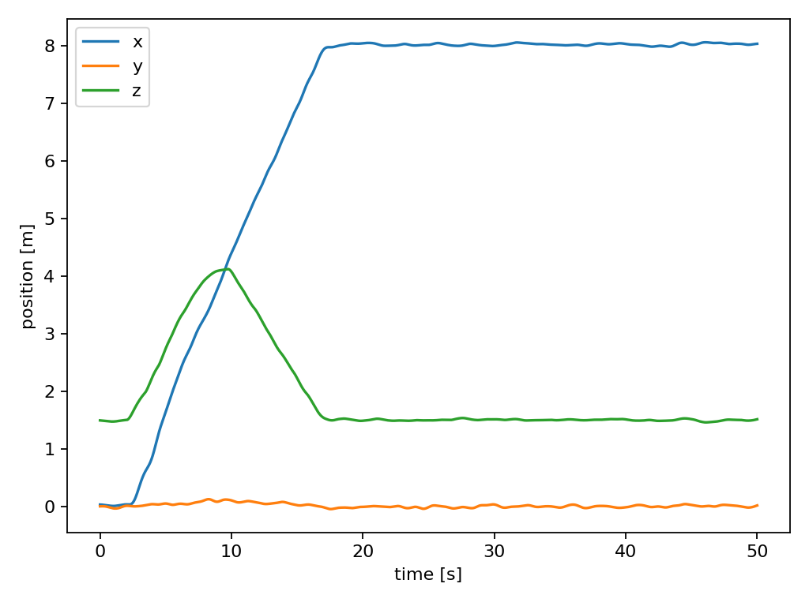<br>**图 7-19　位置与爬升曲线** |
| 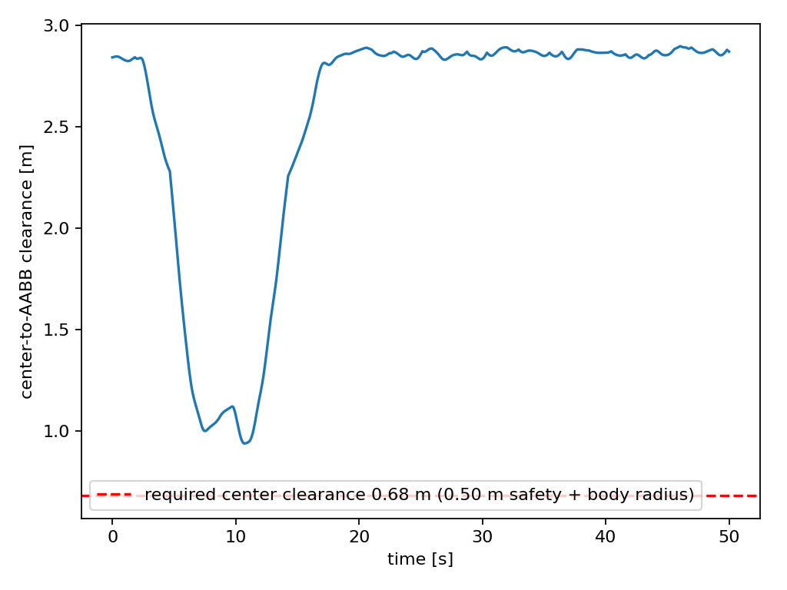<br>**图 7-20　狭窄场景最小净空** | 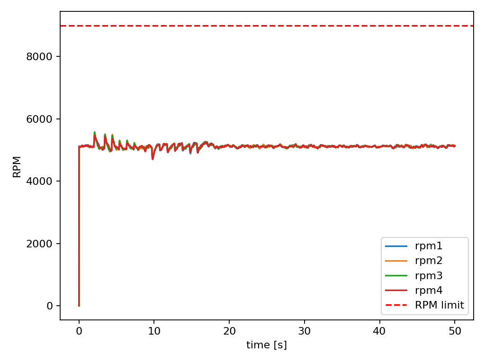<br>**图 7-21　狭窄场景 RPM** |

### 7.10 单元测试与自动评测

当前测试覆盖：

1. 四个相同电机转速产生零三轴力矩；
2. 长时间姿态积分后四元数保持单位长度；
3. 3D A* 能找到越过墙体的垂直绕行路径；
4. 五障碍场景的高密度 B-spline 采样均不进入膨胀体素；
5. B-spline 弧长表正反映射一致。

最近一次 `colcon test-result --verbose` 汇总为 `7 tests, 0 errors, 0 failures, 0 skipped`。此外，`run_experiment.py`、`plot_results.py` 和 `waypoint_mission.py` 提供脚本化记录、绘图和多航点执行。

### 7.11 失败案例：同步规划导致零 RPM 坠地

#### 失败现象

早期版本在规划器 50 Hz 定时器回调中同步执行 A* 和 B-spline 碰撞检查。五障碍搜索耗时超过控制器 `2.5 s` 的参考超时后，控制器把“参考超时”与“里程计失效”视为同一种故障，直接输出四电机零 RPM。实跑中出现：

- 悬停高度约 `1.52 m`；
- 电机从约 `5100 RPM` 降到零；
- 无人机下降到地面 `0.05 m`；
- 规划完成后重新起飞。

#### 根因

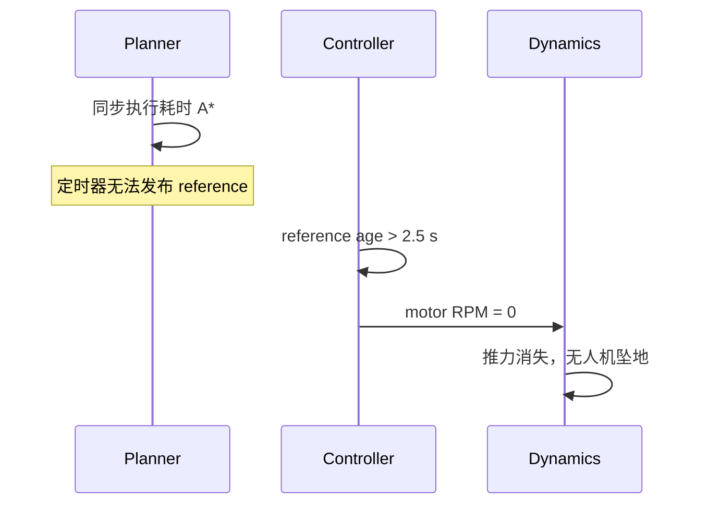
```mermaid
sequenceDiagram
    participant P as Planner
    participant C as Controller
    participant D as Dynamics
    P->>P: 同步执行耗时 A*
    Note over P: 定时器无法发布 reference
    C->>C: reference age > 2.5 s
    C->>D: motor RPM = 0
    D->>D: 推力消失，无人机坠地
```

问题并不在动力学或 mixer，而在实时数据流：规划搜索阻塞了安全参考发布；控制器的超时降级动作也不适合空中飞行器。

#### 修复

1. A*、控制点生成、B-spline 碰撞检查和弧长表构建移入 `std::async` 后台线程；
2. 后台线程只处理地图/起点/目标快照，不直接修改 ROS 状态；
3. 主定时器在 `PLANNING_HOLD` 状态持续发布固定悬停参考；
4. 使用 generation 丢弃被新目标取代的旧规划结果；
5. 控制器将 odom 超时和 reference 超时分开处理；
6. odom 正常但 reference 超时时，锁定当前位置悬停而不是切零 RPM。

#### 修复验证

修复后相同 A* 实际耗时约 `5.30 s`，明显超过旧超时阈值，但规划阶段高度仍保持在 `1.484–1.523 m`。另外暂停规划器进程，人工制造超过 `2.5 s` 的参考断流，控制器打印 `stale reference: holding current position instead of zero RPM`，高度保持在 `1.482–1.526 m`，平均实际 RPM 最低约 `5053 RPM`。这说明主保护和控制器降级保护均生效。

---

## 8. 与参考仓库和同类仿真器的关系

### 8.1 参考内容

项目在算法组织思路上参考了 `IntelligentUAVChampionshipBase/basic_dev/src` 中的三个 ROS1 模块：

| 参考模块 | 借鉴的思路 | 本项目的重写与变化 |
|---|---|---|
| `pwm_se3_controller` | 位置/速度误差、期望合力、期望姿态、姿态误差和 mixer 的分层结构 | 使用 ROS2 `rclcpp` 重写；输出由 PWM 改为物理含义明确的四电机 RPM；增加完整限幅和超时悬停 |
| `imu_gps_fusion` | IMU 预测和 GPS pose 更新的误差状态滤波结构 | 使用 Eigen 和 ROS2 消息重写；实现 15 状态 ESKF 和 Joseph 协方差更新 |
| `AB_planner` | 全局搜索、曲线平滑和局部预测的流水线组织 | 地图改为自研 3D voxel；实现 26 邻域 A*、B-spline 碰撞回退、弧长采样、滚动预测和异步规划 |

项目没有直接依赖参考仓库的 ROS1 节点，也没有把其 package 原样迁移；接口、消息、构建系统、动力学输入输出和安全机制均按本任务重新设计。选择重写而不是封装旧节点，是为了统一 ROS2 QoS、参数文件、frame 约定和四电机 RPM 接口，并确保能够独立解释每一个公式和 topic。

### 8.2 与 pengyu_sim / MARSIM 的工程定位差异

本项目没有直接引入 pengyu_sim 或 MARSIM 源码。下面仅比较工程定位，不声称对它们进行逐行复现：

| 维度 | 本项目 | 大型/高保真无人机仿真项目常见设计 |
|---|---|---|
| 目标 | 教学、算法闭环、快速编译和可解释性 | 更高保真传感器、环境和大规模场景 |
| 动力学 | 自研刚体模型和简化接触 | 可能使用更复杂物理、气动或仿真引擎 |
| 地图 | 连续数组 3D voxel + 盒体 | 可能使用高密度点云、mesh 或复杂地图服务 |
| 感知 | 前向射线步进 LiDAR | 可能支持更丰富扫描模式、并行加速和运动畸变 |
| 规划 | 3D A* + B-spline + 受限滚动预测 | 可能包含更复杂的优化、动态障碍和多传感器链路 |
| 部署 | 6 个小型 ROS2 包，可本机直接运行 | 依赖规模和硬件需求通常更高 |

本项目的优势是小、清晰、每一层都能从源码追到公式；不足是传感器和物理真实度有限，暂不支持动态障碍、多无人机和大规模点云加速。

---

## 9. AI 辅助编程说明

本项目使用 OpenAI Codex 辅助代码审计、问题定位、异步规划修复、测试执行、指标分析和文档整理。AI 没有替代实际验证：所有关键修改均通过本机编译、ROS2 节点日志、CSV、曲线或 GTest 检查。

典型案例是五障碍坠地问题。AI 首先从日志和 CSV 判断参考超时导致零 RPM，再修改规划器和控制器；随后根据用户实跑日志发现启动的仍是旧二进制，通过包路径、二进制字符串和时间戳确认是被 Git 跟踪的旧构建产物，最终强制清理目标并重编译。该过程说明 AI 生成的修改不能仅以“源码看起来正确”作为完成标准，必须验证实际执行的二进制。

完整工具、关键交互、AI 产生过的问题、人工确认内容和验证方法见仓库根目录的 [`ai_usage.md`](../ai_usage.md)。

---

## 10. 局限性与反思

### 10.1 当前局限

1. **动力学保真度有限。** 尚未建模桨叶气动、地效、机身阻力方向差异、电池电压下降和复杂接触；
2. **外力接口未 ROS 化。** 核心模型有外力入口，但没有风场节点、topic 和扰动恢复实验；
3. **规划仍面向静态地图。** LiDAR 主要用于近场威胁确认，没有显式估计动态障碍速度；
4. **滚动预测不是完整优化 MPC。** 当前是受约束的确定性前向 rollout，没有在线求解带代价函数的 QP/NLP；
5. **评测仍未完全自动化。** 五类最低验收场景已有量化曲线，但目前仍需人工分终端启动 launch 和记录器，尚无单命令 CI 汇总；
6. **单元测试覆盖不足。** 控制器 mixer、限幅、超时状态机、ESKF 和 ROS topic 集成尚缺独立自动测试；
7. **仅支持单无人机。** Topic 和 frame 未命名空间化；
8. **Git 仓库卫生需要改进。** `build/`、`install/`、`log/` 不应被版本控制，否则旧时间戳和绝对路径可能使新源码没有正确重编译；
9. **可视化依赖 RViz2。** 没有独立 Web/Qt 地面站；
10. **安全距离口径需要统一。** 中心轨迹距离与机体表面净空应同时报告。

### 10.2 如果继续开发两周，最应该补什么

优先级最高的不是继续堆叠算法，而是建立可重复、不可误用的自动验收链路：

**第一周：工程可靠性和评测闭环**

1. 从 Git 中彻底移除 `build/install/log`，加入 `.gitignore` 和 CI；
2. 新增 launch integration test，自动检查 hover、目标到达、RPM 非零和最小净空；
3. 为 mixer、控制限幅、reference timeout、ESKF 更新增加单元测试；
4. 让评测脚本从 YAML 读取目标和障碍物，避免硬编码；
5. 保存每个验收场景的 CSV、参数快照、Git commit 和自动生成汇总表。

**第二周：仿真能力扩展**

1. 增加 `/drone/external_force` 和可配置阵风/持续风场，展示抗扰恢复；
2. 实现圆轨迹、八字轨迹发生器及跟踪误差统计；
3. 增加动态障碍物和速度估计，升级局部规划；
4. 将 topic/frame 参数化以支持多无人机 namespace；
5. 增加简洁 Web 地面站，显示位置、姿态、RPM、规划状态和安全距离。

若只能选择一项，应首先完成“干净克隆后自动构建并跑完验收场景”的 CI。它能同时约束代码、参数、文档和实验结果，避免再次出现源码已修复但实际运行旧二进制的问题。

---

## 11. 构建与复现实验

### 11.1 构建

```bash
cd ~/sim_drone/ake_drone_sim
source /opt/ros/humble/setup.bash
colcon build --symlink-install
source install/setup.bash
```

如果仓库仍包含历史构建产物，应先清理对应 package 的 build target，确保源码真正重编译。可通过以下字符串确认修复版二进制：

```bash
strings install/drone_planner/lib/drone_planner/ab_planner_node \
  | grep PLANNING_HOLD

strings install/drone_controller/lib/drone_controller/position_controller_node \
  | grep "holding current position"
```

### 11.2 测试

```bash
colcon test
colcon test-result --verbose
```

### 11.3 悬停与单目标

终端 A 使用空旷地图：

```bash
ros2 launch drone_visualization open.launch.py
```

终端 B 记录并绘图；两个实验之间应重新启动终端 A 的 launch：

```bash
ros2 run drone_visualization run_experiment.py \
  --goal 0 0 1.5 --duration 15 --output /tmp/hover.csv
ros2 run drone_visualization plot_results.py \
  /tmp/hover.csv --prefix /tmp/hover

ros2 run drone_visualization run_experiment.py \
  --goal 2 1 1.5 --duration 20 --output /tmp/point.csv
ros2 run drone_visualization plot_results.py \
  /tmp/point.csv --prefix /tmp/point --goal 2 1 1.5
```

### 11.4 五障碍避障

```bash
ros2 launch drone_visualization sim.launch.py
```

另一个已 source 的终端执行：

```bash
ros2 run drone_visualization run_experiment.py \
  --goal 8 0 1.5 --duration 45 --output /tmp/avoid.csv

ros2 run drone_visualization plot_results.py \
  /tmp/avoid.csv --prefix /tmp/avoid \
  --scenario five --safety-distance 0.5
```

### 11.5 多目标和狭窄通道

```bash
ros2 launch drone_visualization open.launch.py
```

另一个终端执行多目标任务并绘图：

```bash
ros2 run drone_visualization waypoint_mission.py \
  --timeout 90 --output /tmp/waypoint.csv
ros2 run drone_visualization plot_results.py \
  /tmp/waypoint.csv --prefix /tmp/waypoint
```

重新启动终端 A：

```bash
ros2 launch drone_visualization narrow.launch.py
```

终端 B 执行：

```bash
ros2 run drone_visualization run_experiment.py \
  --goal 8 0 1.5 --duration 50 --output /tmp/narrow.csv
ros2 run drone_visualization plot_results.py \
  /tmp/narrow.csv --prefix /tmp/narrow \
  --scenario narrow --safety-distance 0.5
```

---

## 12. 结论

本项目实现了从四电机 RPM 到四旋翼刚体状态、从目标点到电机 RPM、从三维地图到安全飞行参考的完整 ROS2 闭环。动力学包含电机一阶响应、推力/力矩、平动/转动和四元数积分；控制器包含位置/速度环、SO(3) 姿态环、mixer 和多级限幅；地图与规划包含 voxel、模拟 LiDAR、3D A*、B-spline、滚动预测和安全回退；RViz2 和脚本提供可视化与量化工具。

五类最低验收场景均已形成可复现命令、曲线和量化结果。悬停、单目标、多目标终点、五障碍终点和强制爬升终点的误差均小于 `0.3 m`；五障碍和强制爬升场景扣除 `0.18 m` 机体半径后的表面净空分别约为 `0.563 m` 和 `0.758 m`，均大于 `0.5 m` 安全距离。更重要的是，项目通过真实失败案例暴露并修复了“耗时规划阻塞参考发布”的系统级问题，说明整体仿真不仅能够运行，也具备通过日志、数据和回归实验定位跨节点故障的能力。
