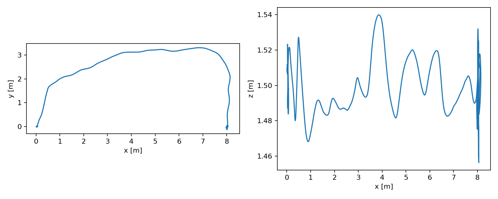
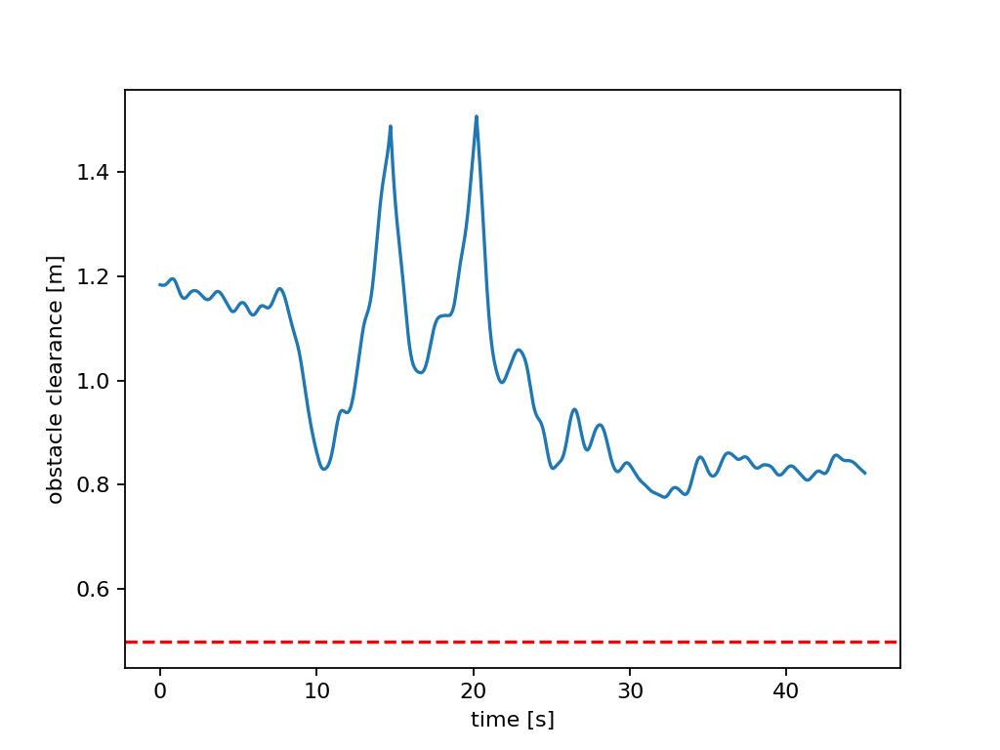
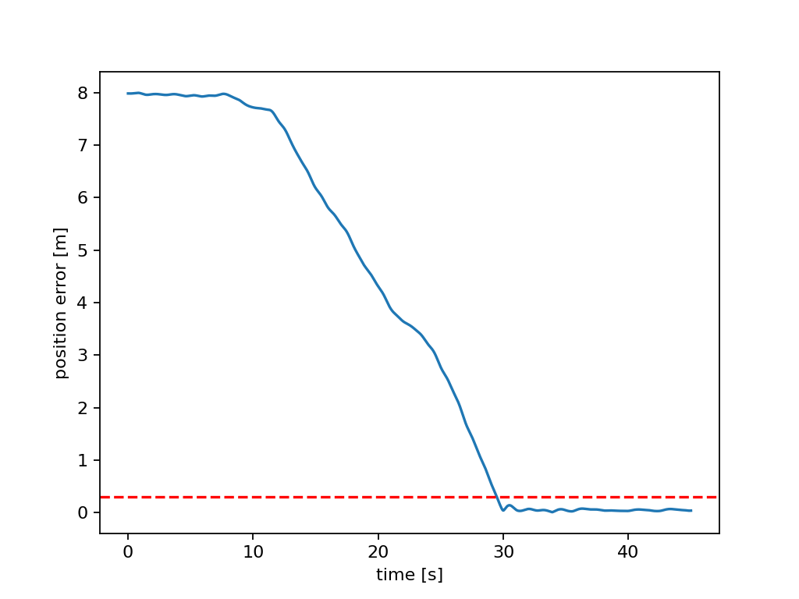
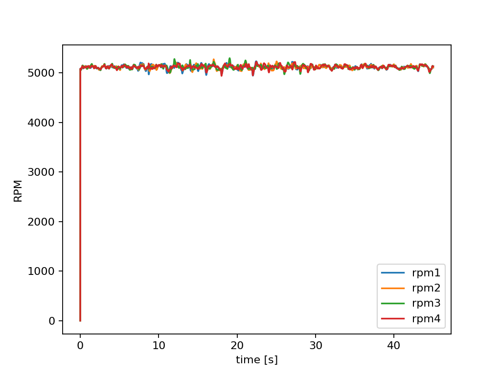

# AKE Drone Sim 实验报告

## 系统说明

测试平台为 Ubuntu 22.04、ROS2 Humble，本地运行，无 Docker、AirSim 或 Gazebo。系统由六个独立 ROS2 包组成，控制器和规划器只使用 ESKF 输出的 `/drone/odom`。

地图使用 0.2 m 三维 voxel grid，规划安全距离 0.5 m，无人机半径 0.18 m。模拟前向 LiDAR 为 120°×60°、10 Hz、8 m 量程，输出 `PointCloud2` 并参与局部威胁检测。

## 已完成验证

### 构建与单元测试

- 六个 ROS2 包可由同一个 `colcon build --symlink-install` 完成构建。
- 动力学测试覆盖等转速零力矩和四元数归一化。
- 规划测试覆盖需要升高绕行的 3D A*、五障碍场景中高密度 B-spline 的体素碰撞检查，以及弧长表正反映射一致性。

### 悬停实验 `(0,0,1.5)`

控制阻尼和目标锁定修改后的本机实跑，取到达后连续 5 s：

- 稳态真值均值约 `(0.015, 0.016, 1.501) m`；
- x/y/z 峰峰摆动约 `0.080/0.085/0.057 m`；
- 速度 RMS 约 `0.059 m/s`；
- roll/pitch 峰峰值约 `3.48°/2.82°`；
- 目标锁定后参考位置、速度和加速度峰峰值均为零；
- 无持续 RPM 饱和。

### 目标点实验 `(2,1,1.5)`

空旷地图 15 s 本机实跑：

- 最终真值位置约 `(2.027, 0.993, 1.524) m`；
- 最终位置误差约 `0.036 m`；
- 无姿态发散或持续 RPM 饱和。

### 五障碍三维 voxel 避障 `(8,0,1.5)`

将 A* 与 B-spline 碰撞检查移入后台线程后，使用 `sim.launch.py` 完成 45 s 本机回归：

- 本次 A* 搜索约 `5.30 s`，搜索期间主定时器持续发布锁定悬停参考；
- 规划等待阶段高度保持在约 `1.484–1.523 m`，四电机平均实际转速始终高于 `5062 RPM`；
- 最终真值位置约 `(8.023, 0.021, 1.520) m`；
- 最终位置误差约 `0.037 m`；
- 实际轨迹到五个原始障碍盒体表面的最小距离约 `0.776 m`；
- 最小距离严格大于配置安全距离 `0.5 m`；
- 实际轨迹采样累计长度约 `14.03 m`；
- LiDAR 点云持续以 10 Hz 接入规划器，规划器输出 A*、B-spline/安全折线回退和滚动预测路径；
- 未出现参考超时、零 RPM、穿障、NaN、姿态发散或 RPM 饱和。

另用暂停规划器进程的方式强制制造超过 `2.5 s` 的参考超时。控制器进入“锁定当前位置”后，高度保持在 `1.482–1.526 m`，四电机平均实际转速最低约 `5053 RPM`，验证参考丢失不会再导致空中切零 RPM。

### 固定种子随机三维场景 `(8,0,1.5)`

使用 `random.launch.py seed:=20260715` 生成 14 个随机盒体和 3204 个占用体素。控制及弧长参考修改后的实跑结果：

- A* 展开 7176 个节点，并安全回退为 A* 折线参考；
- 飞行高度范围约 `1.457–4.099 m`，产生明显三维爬升绕行；
- 最终 6 s 真值均值约 `(8.018, 0.005, 1.504) m`；
- 最终悬停 x/y/z 峰峰值约 `0.063/0.048/0.039 m`；
- 实际轨迹到规划折线的平均/95%/最大距离约 `0.032/0.060/0.122 m`；
- 实际轨迹到最近占用体素中心的距离约 `0.803 m`；扣除 0.2 m 体素半对角线后的保守净空仍约 `0.630 m`，大于 `0.5 m` 安全距离；
- A* 搜索在后台运行，搜索期间持续发布锁定悬停参考；
- 未出现 NaN、姿态发散、穿障或持续 RPM 饱和。

对应曲线保存在 `report/results/`：位置、目标误差、RPM、XY/XZ 轨迹和最小障碍距离。









## 复现实验

悬停和目标点使用 `open.launch.py`；五障碍三维绕行使用 `sim.launch.py`。每次实验前重新启动系统，然后运行：

```bash
ros2 run drone_visualization run_experiment.py --goal 0 0 1.5 --duration 20 --output hover.csv
ros2 run drone_visualization run_experiment.py --goal 2 1 1.5 --duration 20 --output point.csv
ros2 run drone_visualization run_experiment.py --goal 8 0 1.5 --duration 45 --output avoid.csv
```

绘图：

```bash
ros2 run drone_visualization plot_results.py hover.csv --prefix hover
```

评测时同时显示 `/drone/planned_path`、`/drone/bspline_path`、`/drone/mpc_prediction_path`、`/drone/path`、`/map/obstacles` 和 `/drone/lidar/points`。最小障碍物距离以真值轨迹点到原始障碍 AABB 表面的欧氏距离计算，不以膨胀体素中心距离代替。

## 指标定义

- 最终误差：记录末时刻真值位置到目标点的欧氏距离。
- 到达时间：首次进入 0.3 m 球并保持至少 1 s 的时间。
- 稳态误差：最后 3 s 位置误差均值。
- 路径长度：相邻真值轨迹采样点距离之和。
- 最小障碍距离：轨迹到所有盒体表面的最小距离。
- RPM 饱和率：任一电机到达最大 RPM 的采样比例。

## 失败条件

规划器在目标越界/占用、无路径、搜索超预算、平滑轨迹碰撞、LiDAR 长时间超时或预测轨迹碰撞时发布状态并悬停。B-spline 不安全时优先回退到经过膨胀 voxel 碰撞检查的 A* 折线参考。
